# CSE 412 Group Project - UI

# Table of Contents
1) [About](#about)
2) [API](#api)
3) [Installation](#installation)
4) [Startup](#startup)
5) [Build](#build)

## About
This project is an instant messaging application written using React, which allows you to create an account, send friend requests to other users, and start a conversation (either a private message, or a group thread).

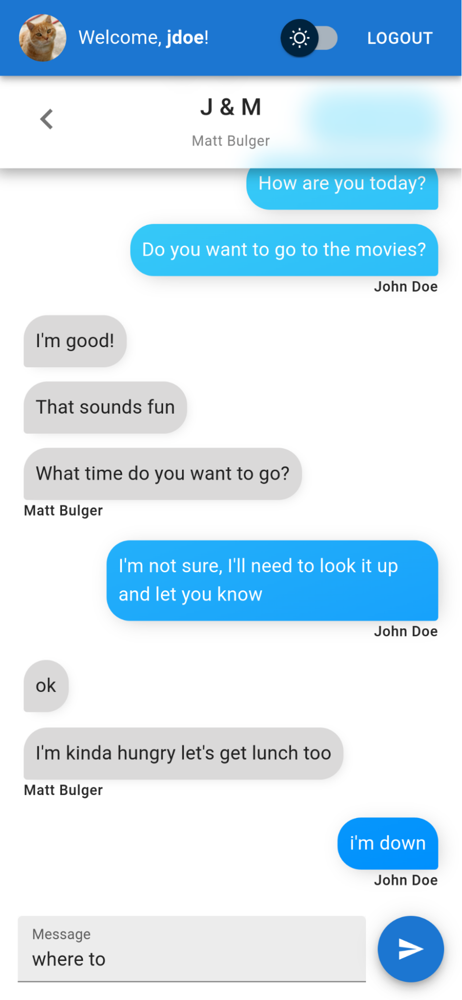
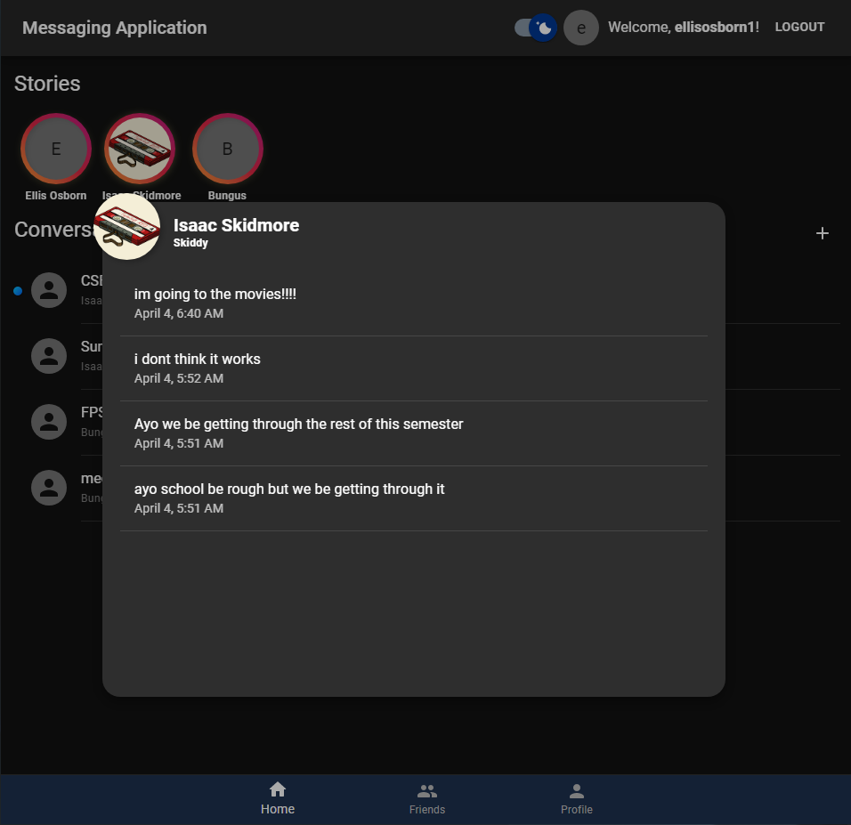

## API
The backend API for this project (a Flask application written in Python) can be found here:

### [https://github.com/MCBulger2/CSE412-GroupProject-API](https://github.com/MCBulger2/CSE412-GroupProject-API)

## Installation

### UI Dependencies
We assume that [node.js](https://nodejs.org/en/) is already installed. Please download and install the appropriate version for your operating system if it is not already.

To install all dependencies, run the following command in root project folder:

`npm install`

Once dependencies are installed, you can procede with the startup procedure.

### API
For the UI to actually do anything, it needs to send requests to the corresponding API, which is located in a different project. Please install and run the API before starting up the UI.

## Startup
Before startup, ensure both the API is running, and the UI dependencies are installed.

The UI can be started in either HTTP mode or HTTPS mode. You should use HTTP mode for testing, but HTTPS is required to make cross-origin CORS requests to the API.

### HTTP
To start the UI in HTTP mode (on port 3000), use the command:

`npm run startHttp`

### HTTPS
To make cross-origin requests to the API, not only do you need to run the application in HTTPS mode, but your origin domain must also be listed in the API's list of allowed origins.

To start the UI in HTTPS mode (on port 3001), use the command:

`npm start`

## Build
while the [Startup](#startup) proceduces are good for local development and testing, when deploying to the production server, you want to create an optimized build, which is more responsive, a smaller size.

Run the following command to build the UI:

`npm run build`

When it completes, there will be a new `build` folder in the root of the project. The contents of this folder can be hosted will any normal webserver, like Nginx (which is what we are using in production), Apache, or the Node.js `serve` package.

# Application Demo
## Login Screen (Light & Dark Mode)
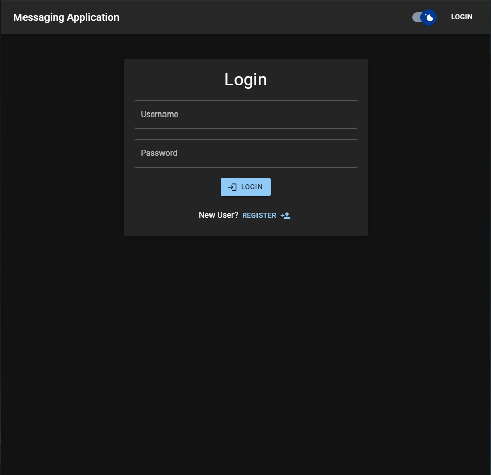

## Registration Page
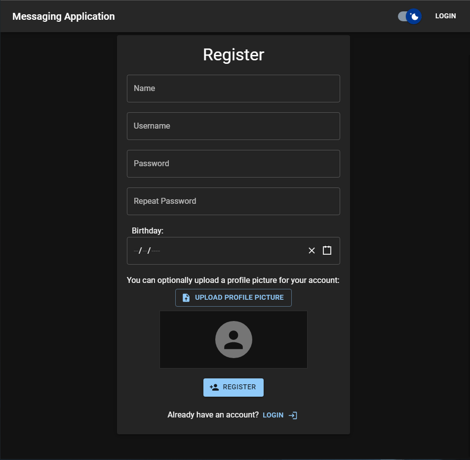

## Home Page
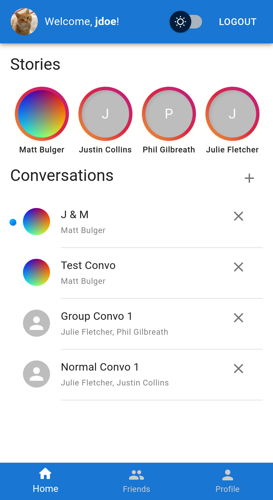

## Adding Friends
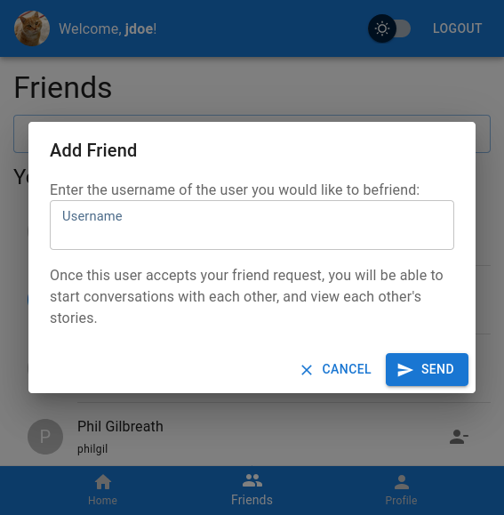
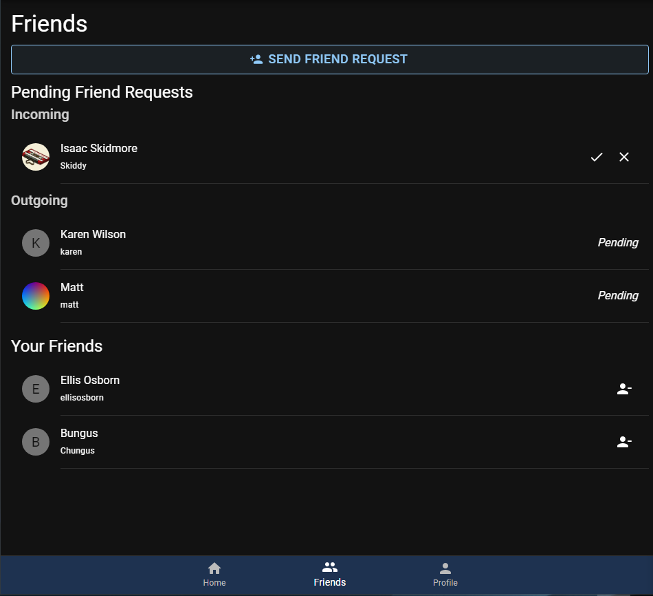

## Creating Individual & Group Conversations
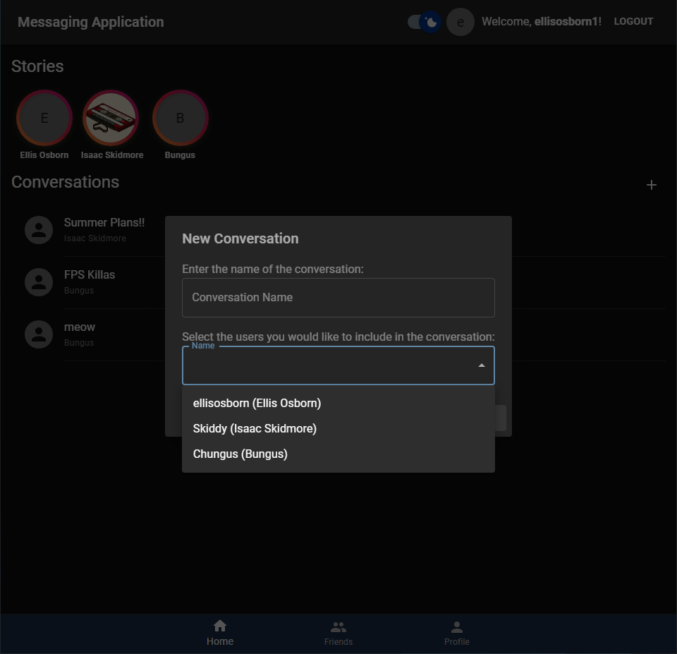

## Deleting Conversations
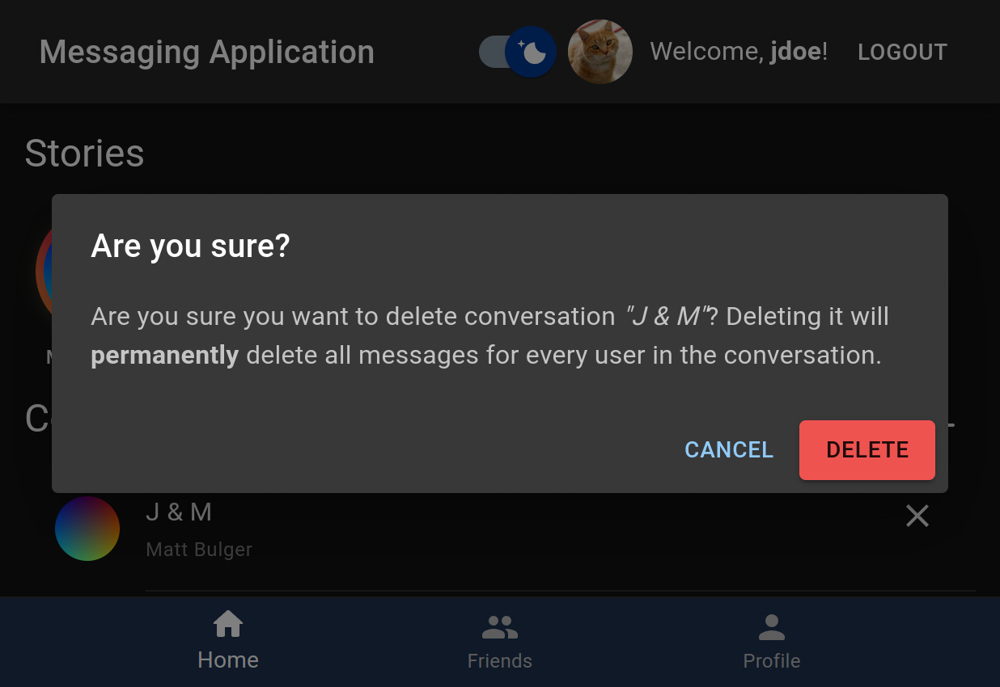

## Viewing/Posting Stories
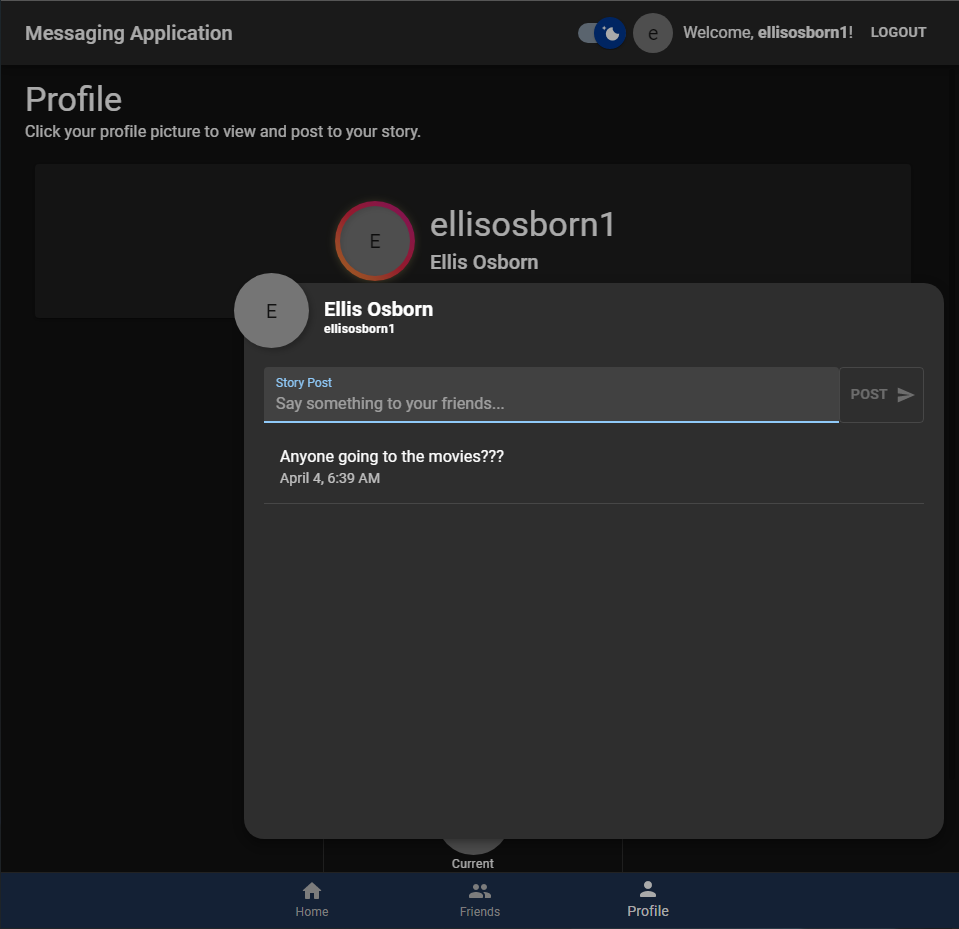

## Updating Profile
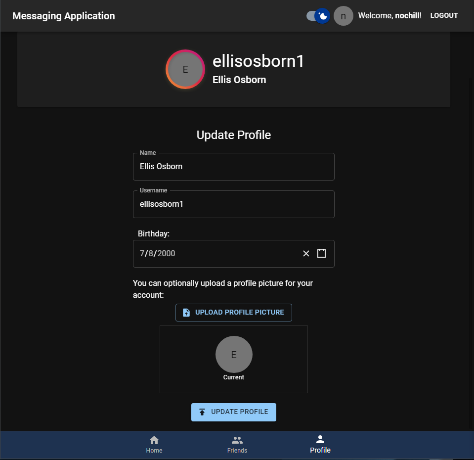
